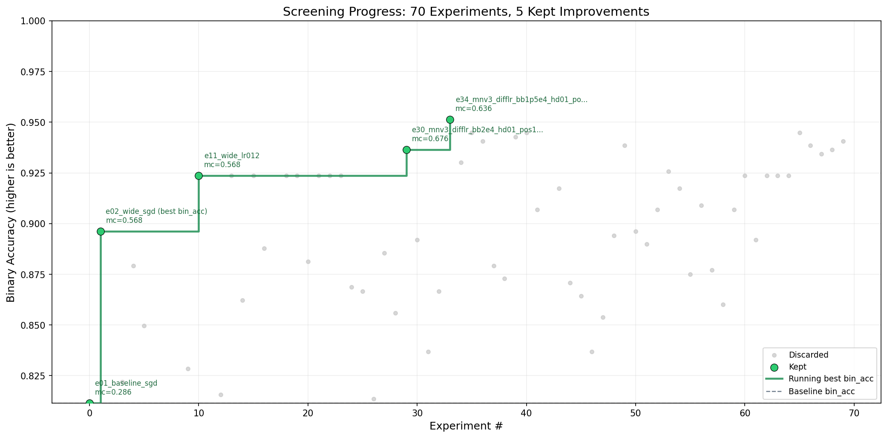

# autoresearch for NTUH PD exit-site classification

Model checkpoint on Hugging Face: [ruby0322/pd-exit-site-classification](https://huggingface.co/ruby0322/pd-exit-site-classification). You can download the model here.




- **`e41` result**: leveraged autoresearch to efficiently reach **96.8% infection-screening accuracy** after training for 30+ epochs, outperforming [NTUH's work](https://academic.oup.com/ndt/article/40/Supplement_3/gfaf116.1582/8295727).
- **Top-performing recipe**: built the top-performing model with MobileNetV3 transfer learning, differential-LR fine-tuning, and positive-class reweighting.

## Current setting

- **Dataset**: ImageFolder-style dataset rooted at `./dataset`
- **Classes**: 5 classes, with `class_4` treated as infection-positive
- **Primary metric**: `bin_acc`
- **Secondary metric**: `mc_acc`
- **Training budget**: fixed **300 seconds** wall-clock per experiment
- **Canonical image size**: `384`
- **Loop summary artifacts**: `analysis_summary.json` and `analysis_summary.md`

At the time of writing, the current screening frontier is the `e34...` configuration, which reaches **`bin_acc=0.951271`** with **`mc_acc=0.635593`**.

## How it works

The repo is intentionally small. These are the important files:

- **`prepare.py`**: shared constants, dataset validation, and the fixed evaluation harness. Do not modify it during experiments.
- **`train.py`**: the model/training file the agent iterates on.
- **`program.md`**: the research-loop instructions the agent follows.
- **`results.tsv`**: append-only experiment log, kept out of git.
- **`summarize_results.py`**: derives the current frontier and idea hints from `results.tsv`.
- **`analysis.ipynb`**: human-facing notebook for `bin_acc`-first analysis with `mc_acc` as side context.

The loop is:

1. edit `train.py`
2. run a 5-minute experiment
3. parse the footer metrics from stdout
4. append a row to `results.tsv`
5. regenerate `analysis_summary.json` and `analysis_summary.md`
6. keep or discard the change based on the frontier rules in `program.md`

## Metrics and keep rules

Each result row has this schema:

```tsv
commit	mc_acc	bin_acc	memory_gb	status	description
```

The keep/discard policy is:

- keep if `bin_acc` is strictly higher than the current best
- keep if `bin_acc` ties the current best and `mc_acc` improves
- keep if both metrics tie and the code becomes simpler
- discard otherwise

This means the loop is explicitly **screening-first**, not multiclass-first.

## Quick start

**Requirements:** Python `3.10`, a virtual environment, and preferably a CUDA-capable GPU for the full research loop. Dependencies live in `requirements.txt`.

```bash
python3 -m venv .venv
source .venv/bin/activate   # Windows: .venv\Scripts\activate
pip install -U pip
pip install -r requirements.txt

# Validate dataset structure and sample image readability
python prepare.py

# Run one training job
python train.py

# Derive loop summary artifacts from results.tsv
python summarize_results.py
```

If `prepare.py` succeeds and `train.py` prints the metric footer, the setup is ready.

## Training output

`train.py` prints a machine-readable footer that the loop uses to log results:

```text
---
mc_acc:               0.563600
bin_acc:              0.712300
train_seconds:        300.2
train_stopped_budget: true
peak_vram_mb:         1234.5
arch:                 baseline
optimizer:            sgd
```

The summary script turns `results.tsv` into:

- `analysis_summary.json`: machine-readable frontier state for the agent
- `analysis_summary.md`: short human-readable summary

The notebook in `analysis.ipynb` visualizes the same history with `bin_acc` as the main plot and `mc_acc` as supporting context.

## Running the agent

Point your coding agent at `program.md` and let it drive the experiment loop. A minimal prompt is:

```text
Read program.md, set up the run, and start the next experiment loop.
```

The agent is expected to:

- use `program.md` as the source of truth
- modify only `train.py`
- leave `prepare.py` untouched
- update `results.tsv` after every run
- regenerate the summary files with `python summarize_results.py`
- use `analysis_summary.json` before choosing the next experiment

## Project structure

```text
prepare.py            dataset validation + fixed evaluation harness
train.py              image-classification model and training loop
program.md            agent instructions for the research loop
results.tsv           experiment log (ignored by git)
summarize_results.py  frontier summarizer for the loop
analysis.ipynb        notebook analysis of experiment history
requirements.txt      Python dependencies
```

## Design choices

- **Single-file experimentation**: the agent only edits `train.py`, which keeps diffs reviewable.
- **Fixed-time comparison**: every run gets the same 300-second budget, so results are comparable on the same machine.
- **Screening-first optimization**: `bin_acc` defines the frontier; `mc_acc` is important but secondary.
- **Derived loop memory**: `analysis_summary.json` gives the agent a compact view of the frontier, near misses, and recently bad directions.

## Platform notes

The code will select CUDA when available and fall back to CPU otherwise, but the intended research-loop setting is a single GPU. CPU runs are useful for smoke tests, not for efficient overnight search.

## License

MIT
